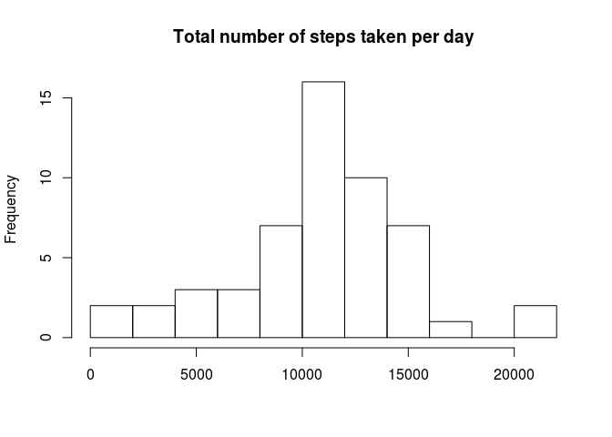
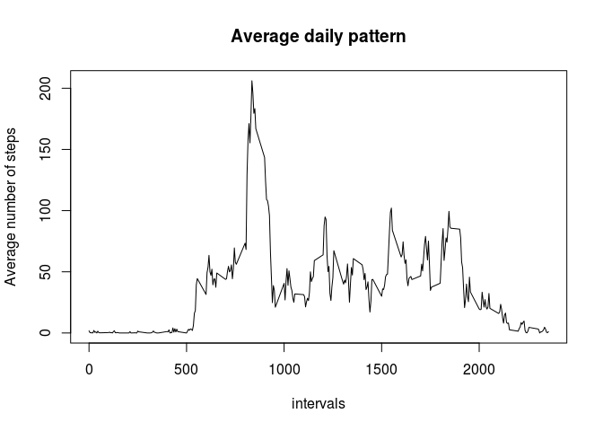
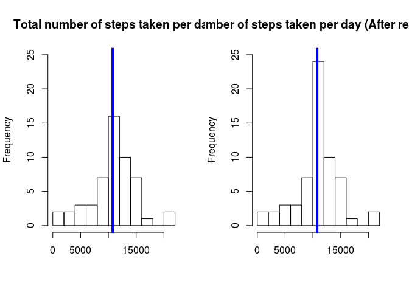
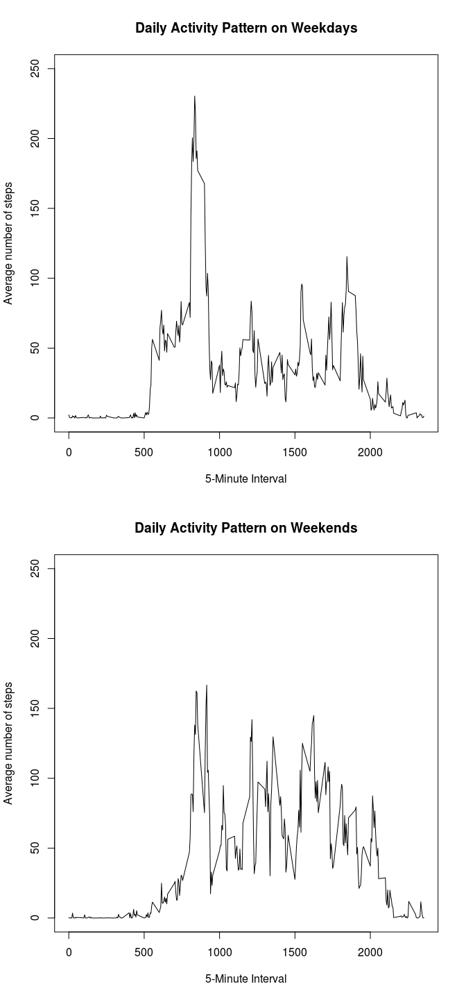

# Reproducible Research: Peer Assessment 1


## Loading and preprocessing the data


```r
if(!file.exists("activity.csv")){
        unzip("activity.zip")
}

activity <- read.csv("activity.csv",colClasses = c('integer','Date','integer'))

str(activity)
```

```
## 'data.frame':	17568 obs. of  3 variables:
##  $ steps   : int  NA NA NA NA NA NA NA NA NA NA ...
##  $ date    : Date, format: "2012-10-01" "2012-10-01" ...
##  $ interval: int  0 5 10 15 20 25 30 35 40 45 ...
```

```r
sum(is.na(activity))
```

```
## [1] 2304
```


Removing missing value from the dataset


```r
activity_without_na <- activity[which(!is.na(activity$steps)),]
str(activity_without_na)
```

```
## 'data.frame':	15264 obs. of  3 variables:
##  $ steps   : int  0 0 0 0 0 0 0 0 0 0 ...
##  $ date    : Date, format: "2012-10-02" "2012-10-02" ...
##  $ interval: int  0 5 10 15 20 25 30 35 40 45 ...
```


## What is mean total number of steps taken per day?

To find steps taken per day


```r
steps_taken_perday <- tapply(activity_without_na$steps,activity_without_na$date,sum)
##head(aggregate(activity_without_na,by=list(steps,date),sum))
head(steps_taken_perday)
```

```
## 2012-10-02 2012-10-03 2012-10-04 2012-10-05 2012-10-06 2012-10-07 
##        126      11352      12116      13294      15420      11015
```

```r
hist(steps_taken_perday,15,main = "Total number of steps taken per day",xlab="")
```

 

```r
mean(steps_taken_perday)
```

```
## [1] 10766.19
```

```r
median(steps_taken_perday)
```

```
## [1] 10765
```


## What is the average daily activity pattern?


```r
average_daily_pattern <- tapply(activity_without_na$steps,activity_without_na$interval,mean)

plot(y=average_daily_pattern,x=names(average_daily_pattern),main="Average daily pattern",type='l',ylab="Average number of steps",xlab = "intervals")
```

 
Which 5-minute interval, on average across all the days in the dataset, contains the maximum number of steps?


```r
average_daily_pattern[average_daily_pattern==max(average_daily_pattern)]
```

```
##      835 
## 206.1698
```


## Imputing missing values


```r
activity_mod <-activity

activity_mod[which(is.na(activity$steps)),1] <-average_daily_pattern[as.character(activity[which(is.na(activity$steps)),3])]

sum(is.na(activity_mod))
```

```
## [1] 0
```

```r
steps_taken_perday_new <- tapply(activity_mod$steps,activity_mod$date,sum)

par(mfrow=c(1,2))

hist(steps_taken_perday,15,main = "Total number of steps taken per day",xlab="",ylim=c(0,25))
abline(v = median(steps_taken_perday), col = 4, lwd = 4)

hist(steps_taken_perday_new,15,main = "Total number of steps taken per day (After replacing NAs",xlab="",ylim=c(0,25))
abline(v = median(steps_taken_perday_new), col = 4, lwd = 4)
```

 

```r
mean(steps_taken_perday_new)
```

```
## [1] 10766.19
```

```r
median(steps_taken_perday_new)
```

```
## [1] 10766.19
```

```r
mean(steps_taken_perday_new)-mean(steps_taken_perday)
```

```
## [1] 0
```

```r
median(steps_taken_perday_new)-median(steps_taken_perday)
```

```
## [1] 1.188679
```
## Are there differences in activity patterns between weekdays and weekends


```r
activity_mod$wd <- weekdays(activity_mod$date)
activity_mod$fweekdays <- as.factor(c("weekend","weekday"))
activity_mod[activity_mod$wd=="Sunday"|activity_mod$wd=="Saturday",5] <-factor("weekend")
activity_mod[!(activity_mod$wd=="Sunday"|activity_mod$wd=="Saturday"),5] <-factor("weekday")

activity_mod_we <- subset(activity_mod,fweekdays=="weekend")
activity_mod_wd <- subset(activity_mod,fweekdays=="weekday")

steps_taken_we <- tapply(activity_mod_we$steps,activity_mod_we$interval,mean)
steps_taken_wd <- tapply(activity_mod_wd$steps,activity_mod_wd$interval,mean)

par(mfrow=c(2,1))
plot(y = steps_taken_wd, x = names(steps_taken_wd), type = "l", xlab = "5-Minute Interval", 
     main = "Daily Activity Pattern on Weekdays", ylab = "Average number of steps", 
     ylim =c(0, 250))
plot(y = steps_taken_we, x = names(steps_taken_we), type = "l", xlab = "5-Minute Interval", 
     main = "Daily Activity Pattern on Weekends", ylab = "Average number of steps", 
     ylim =c(0, 250))
```

 

